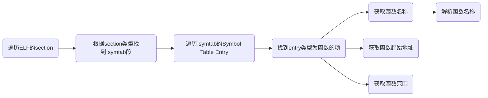
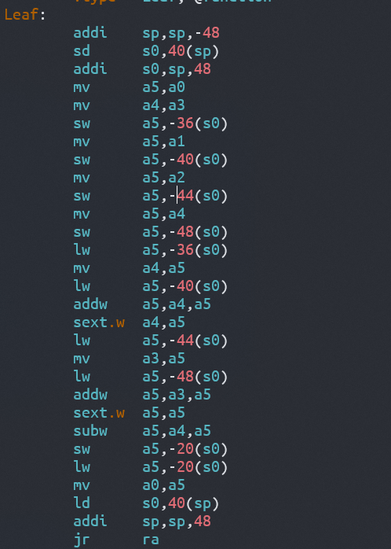

# rtrace

此工具用于在OS `panic`时进行堆栈回溯，打印函数调用路径，目前只支持`riscv`平台。

## 如何获取函数信息

### 法1

在栈回溯时，需要查询函数信息，而这些函数信息主要包含于可执行文件中。具体的细节可以在[elf文件函数信息](https://blog.csdn.net/Chasing_Chasing/article/details/96750109)这里查看，这里给出主要的查找过程




由于`rust`会对函数名称进行重整，类似于c++，因此需要使用相应工具进行解析才能转为可读的名称。同时，汇编文件中的函数可能不会被上述过程收集到。

### 法2

为了使得内核函数符号信息在内核中可用，需要对内核进行两次编译，第一次编译的结果是不包含符号信息的，第二次编译结果包含符号信息，这样就可以在内核中读取符号信息了。具体的做法是将符号信息组织在`.section .rodata`段，这样在第二次编译链接时就不会破坏代码段的地址信息，然后再内核中导出信息即可。

为了获取函数信息，这里使用linux下`nm `命令，其可以解析出可执行文件中的符号信息，包括起始地址，符号类型，符号名称等。

使用`nm -n ...`可以按地址递增的顺序打印符号信息。

## 栈回溯分类

### 第一类

主要有两种堆栈回溯方式，一种是使用`sp`和`fp`指针进行回溯，如下图所示，在这种方式下，每当函数进行开辟栈帧操作后，就会保存`ra` `tp`的值，然后令`fp`指向当前的栈顶，


在这种情况下，在进行栈回溯时，首先根据`fp`寄存器指向的地址，取出保存在函数栈中`ra`和`fp`寄存器的数据,`ra`的值是函数返回地址，`fp`的值是上一级函数栈的栈顶地址,根据`ra`的值到收集的函数信息中查找此地址是否位于某个函数的范围，如果是，则记录函数信息，然后根据`fp`回到上一级函数，继续读取`ra`和`fp`的值，指导无法找到对应的函数区间。

### 第二类

第二种回溯方式是由于某些编译器不会利用`fp`生成上述的代码，一般会在ELF文件中插入`.eh_frame`段，这种方法需要额外的手段进行解析。此工具目前也提供了利用这个段进行回溯的方法。


## 第一种方法

本工具根据一般函数生成形式，比如rust生成的一段`risc-v`代码如下

```
0000000080210412 <my_trace>:
    80210412:   7149                    addi    sp,sp,-368
    80210414:   f686                    sd      ra,360(sp)
    80210416:   f2a2                    sd      s0,352(sp)
    80210418:   eea6                    sd      s1,344(sp)
    8021041a:   eaca                    sd      s2,336(sp)
    8021041c:   e6ce                    sd      s3,328(sp)
    8021041e:   e2d2                    sd      s4,320(sp)
    80210420:   fe56                    sd      s5,312(sp)
    80210422:   fa5a                    sd      s6,304(sp
```

可以看到，函数的前两条指令是开辟栈空间和保存`ra`的指令，因此这里一个简单的想法就是通过读取函数的第一条指令和第二条指令，获取到开辟的栈空间大小以及`ra`存储的位置，这里`ra`一般就是存储在栈顶，读取第二条指令主要是确保这条指令是保存`ra`的指令。再使用汇编指令读取当前的`sp`值，就可以得到下面的回溯方式：

```
读取函数第一条指令和第二条指令获得栈大小size
栈底: sp
栈顶: sp + size
ra : m[sp+size-8]
寻找ra所在函数
将找到的函数设置为当前函数
再次重复上述过程
```

因此主要工作在于如何解析函数的第一条和第二条指令，通过查询risc-v手册可以找到各条指令的格式，比如`addi`指令的格式


读取第一条指令并按照上面的格式解析出立即数部分就可以得到栈大小，但由于risc-v的编译器会做某些优化，将`addi`指令使用压缩指令表示，而压缩指令一般是两字节格式，比如`c.addi`指令的格式如下:


因此需要根据压缩指令和未压缩的指令共同判断第一条指令是否未开辟栈空间的指令和栈空间大小。同理，判断第二条指令也需要如上的工作。

## 第二种方法

具体的实现请查看源代码。


## 使用方法

## elfinfo 

[os-module/elfinfo (github.com)](https://github.com/os-module/elfinfo)

这个工具可以将`nm -n`的输出转换为汇编文件，将符号信息写入文件中，具体的格式如下：

```assembly
.section .rodata
.align 3
.global symbol_num
.global symbol_address
.global symbol_index
.global symbol_name
symbol_num:
.quad 0
symbol_address:
symbol_index:
symbol_name:

```

`symbol_num`表示符号数目

`symbol_address`表示符号起始地址

`symbol_index`表示符号的名称起始位置

`symbol_name`部分是符号的名称

内核发生panic时需要读取编译时嵌入到内核二进制文件中的函数符号信息，并传递给`rtrace` 模块，`rtrace`进行堆栈回溯收集信息并返回给内核。编译内核两次是因为第一次编译完成后我们需要拿到函数符号信息并用`elfinfo`工具生成一个汇编文件，并在第二次编译时嵌入到内核数据中。所以第一次编译时需要生成一份伪造的汇编文件以免内核编译报错，这只需要声明汇编文件中的几个符号，并在`build.rs`生成上面所示的一个空的汇编文件即可。

```rust
// kernel/trace/
extern "C" {
    fn symbol_num();
    fn symbol_address();
    fn symbol_index();
    fn symbol_name();
}
// build.rs
fn main() {
    println!("cargo:rerun-if-changed=../user/src/");
    println!("cargo:rerun-if-changed={}", TARGET_PATH);
    println!("cargo:rerun-if-changed={}", "src");
    let path = Path::new("src/trace/kernel_symbol.S");
    if !path.exists() {
        let mut file = File::create(path).unwrap();
        write!(file, ".section .rodata\n").unwrap();
        write!(file, ".align 3\n").unwrap();
        write!(file, ".global symbol_num\n").unwrap();
        write!(file, ".global symbol_address\n").unwrap();
        write!(file, ".global symbol_index\n").unwrap();
        write!(file, ".global symbol_name\n").unwrap();
        write!(file, "symbol_num:\n").unwrap();
        write!(file, ".quad {}\n", 0).unwrap();
        write!(file, "symbol_address:\n").unwrap();
        write!(file, "symbol_index:\n").unwrap();
        write!(file, "symbol_name:\n").unwrap();
    }
}
```


## 一些特殊情况

```c
int Leaf(int g, int h, int i, int j) {
    int f;
    f = (g + h) - (i + j);
    return f;
}
int main(){
    Leaf(1,1,1,1);
    return 0;
}
```

对于这样一段C语言代码，如果使用默认的gcc对其编译，得到的汇编代码如下




在`Leaf`函数中，可以看到并没有保存`ra`寄存器的指令，但在main函数中则保存了。对于一个函数来说，其一般在内部调用其他函数时才会保存`ra`寄存器，因此当我们使用frame point方法进行回溯的时候，不能直接就确定(fp-8)位置处保存的就是ra。


### 2 不保存ra导致无法回溯

对于这样一段rust代码:

```rust
pub fn current_cpu() -> &'static mut CPU {
    let hart_id = arch::hart_id();
    unsafe {
        panic!("Test panic");
        ....
    }
    ....
}
```

编译在生成这样的代码时，不会生成保存ra的指令，因为这是一个直接panic的函数，意味着不会再次回到这个函数，这导致利用编译器代码生成特点进行回溯的方法无法获取到ra的值，只能在使用DWARF方法时才能解决这个歌问题。内核中这样的代码比较少见。

### 3 多次使用addi sp, sp指令

这种情况下，无论是基于fp，还是使用编译器指令生成回溯都比较困难。


## How To Enable eh-frame-hdr

```
rustflags = [
    "-C", "force-unwind-tables=yes",
    "-C", "link-args=--eh-frame-hdr"
]
```


## 参考资料
https://blog.csdn.net/pwl999/article/details/107569603
https://doc.rust-lang.org/rustc/codegen-options/index.html

[Unwinding the stack the hard way • lesenechal.fr](https://lesenechal.fr/en/linux/unwinding-the-stack-the-hard-way)

[DWARF Debugging Information Format Version 5 (dwarfstd.org)](https://dwarfstd.org/doc/DWARF5.pdf)

[linux 栈回溯(x86_64 ) - 知乎 (zhihu.com)](https://zhuanlan.zhihu.com/p/302726082)

[RISC-V 编程之 Frame Pointer和 backtrace_riscv backtrace_半斗米的博客-CSDN博客](https://blog.csdn.net/zoomdy/article/details/123140219)

[Airs – Ian Lance Taylor » .eh_frame_hdr](https://www.airs.com/blog/archives/462)
