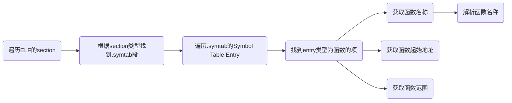

# 内核符号信息

## 如何获取函数信息

### 法1

在栈回溯时，需要查询函数信息，而这些函数信息主要包含于可执行文件中。具体的细节可以在[elf文件函数信息](https://blog.csdn.net/Chasing_Chasing/article/details/96750109)这里查看，这里给出主要的查找过程




由于`rust`会对函数名称进行重整，类似于c++，因此需要使用相应工具进行解析才能转为可读的名称。同时，汇编文件中的函数可能不会被上述过程收集到。

### 法2

为了使得内核函数符号信息在内核中可用，需要对内核进行两次编译，第一次编译的结果是不包含符号信息的，第二次编译结果包含符号信息，这样就可以在内核中读取符号信息了。具体的做法是将符号信息组织在`.section .rodata`段，这样在第二次编译链接时就不会破坏代码段的地址信息，然后再内核中导出信息即可。

为了获取函数信息，这里使用linux下`nm `命令，其可以解析出可执行文件中的符号信息，包括起始地址，符号类型，符号名称等。

使用`nm -n ...`可以按地址递增的顺序打印符号信息。

## [elfinfo](https://github.com/os-module/elfinfo)

这个工具可以将`nm -n`的输出转换为汇编文件，将符号信息写入文件中，具体的格式如下：

```assembly
.section .rodata
.align 3
.global symbol_num
.global symbol_address
.global symbol_index
.global symbol_name
symbol_num:
.quad 0
symbol_address:
symbol_index:
symbol_name:

```

`symbol_num`表示符号数目

`symbol_address`表示符号起始地址

`symbol_index`表示符号的名称起始位置

`symbol_name`部分是符号的名称

内核发生panic时需要读取编译时嵌入到内核二进制文件中的函数符号信息，并传递给`tracer` 模块，`tracer`进行堆栈回溯收集信息并返回给内核。编译内核两次是因为第一次编译完成后我们需要拿到函数符号信息并用`elfinfo`工具生成一个汇编文件，并在第二次编译时嵌入到内核数据中。所以第一次编译时需要生成一份伪造的汇编文件以免内核编译报错，这只需要声明汇编文件中的几个符号，并在`build.rs`生成上面所示的一个空的汇编文件即可。

```rust
// kernel/trace/
extern "C" {
    fn symbol_num();
    fn symbol_address();
    fn symbol_index();
    fn symbol_name();
}
// build.rs
fn main() {
    println!("cargo:rerun-if-changed=../user/src/");
    println!("cargo:rerun-if-changed={}", TARGET_PATH);
    println!("cargo:rerun-if-changed={}", "src");
    let path = Path::new("src/trace/kernel_symbol.S");
    if !path.exists() {
        let mut file = File::create(path).unwrap();
        write!(file, ".section .rodata\n").unwrap();
        write!(file, ".align 3\n").unwrap();
        write!(file, ".global symbol_num\n").unwrap();
        write!(file, ".global symbol_address\n").unwrap();
        write!(file, ".global symbol_index\n").unwrap();
        write!(file, ".global symbol_name\n").unwrap();
        write!(file, "symbol_num:\n").unwrap();
        write!(file, ".quad {}\n", 0).unwrap();
        write!(file, "symbol_address:\n").unwrap();
        write!(file, "symbol_index:\n").unwrap();
        write!(file, "symbol_name:\n").unwrap();
    }
}
```

## 符号查找

从保存的内核符号信息中根据地址查找符号的实现如下:

```rust
pub fn find_symbol_with_addr(addr:usize)->Option<(usize,&'static str)>{
    let symbol_num_addr = symbol_num as usize as *const usize;
    let symbol_num = unsafe { symbol_num_addr.read_volatile() };
    if symbol_num == 0 {
        return None;
    }
    let symbol_addr = symbol_address as usize as *const usize; // 符号地址存储区域
    let addr_data = unsafe { core::slice::from_raw_parts(symbol_addr, symbol_num) };
    // find the symbol with the nearest address
    let mut index = -1isize;
    for i in 0..symbol_num-1{
        if addr>= addr_data[i] && addr<addr_data[i+1]{
            index = i as isize;
            break;
        }
    }
    if addr == addr_data[symbol_num-1]{
        index = (symbol_num-1) as isize;
    }
    if index == -1{
       return None;
    }
    let index = index as usize;
    let symbol_index = symbol_index as usize as *const usize; // 符号字符串的起始位置
    let index_data = unsafe { core::slice::from_raw_parts(symbol_index, symbol_num) };
    let symbol_name = symbol_name as usize as *const u8; // 符号字符串
    let mut last = 0;
    unsafe {
        for i in index_data[index].. {
            let c = symbol_name.add(i);
            if *c == 0 {
                last = i;
                break;
            }
        }
    }
    let name = unsafe {
        core::slice::from_raw_parts(
            symbol_name.add(index_data[index]),
            last - index_data[index],
        )
    };
    let name = core::str::from_utf8(name).unwrap();
    Some((addr_data[index], name))
}
```

